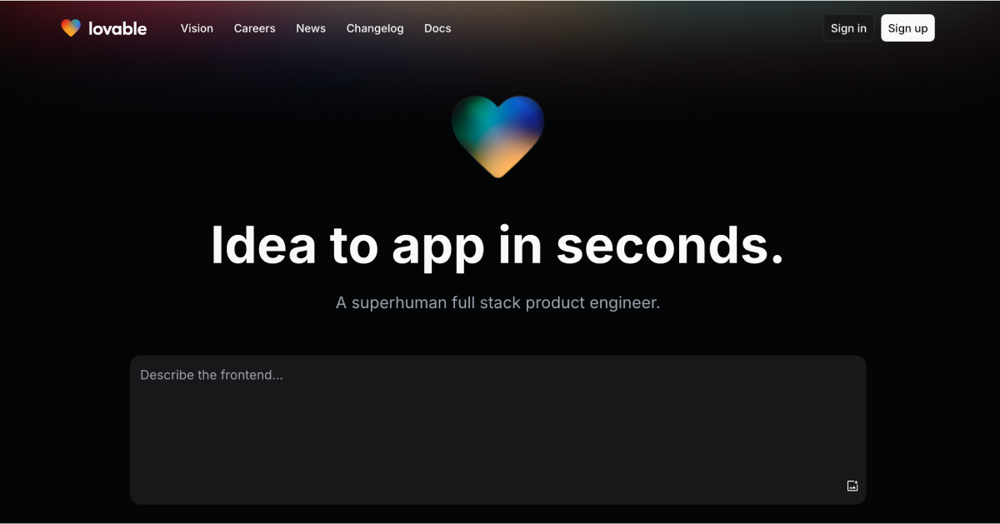

# Accountly - Next Generation Accounting Solution

## Executive Summary

Accountly is a modern, AI-powered accounting platform designed to revolutionize how businesses manage their finances. Our solution combines cutting-edge technology with intuitive design to provide a comprehensive suite of accounting tools accessible to businesses of all sizes.

## Investment Opportunity

The global accounting software market is projected to reach $28.7 billion by 2028, growing at a CAGR of 8.5%. Accountly is uniquely positioned to capture a significant portion of this market with our innovative approach to accounting solutions.

### Key Differentiators

- **AI-Powered Analysis**: Advanced algorithms provide insights and recommendations based on financial data
- **Bank-Level Security**: Enterprise-grade security protocols protect sensitive financial information
- **User-Centric Design**: Intuitive interface reduces the learning curve for accounting software
- **Seamless Integrations**: Connect with major banking institutions, payment processors, and business tools

## Market Analysis

### Target Market

Accountly primarily targets:
- Small to medium-sized businesses (5-500 employees)
- Freelancers and solopreneurs
- Accounting professionals seeking modern tools

### Competitive Landscape

While established players dominate the accounting software market, they often rely on legacy systems with dated user experiences. Accountly offers a fresh alternative with modern technology and user-friendly design.

| Competitor | Strengths | Weaknesses | Accountly's Advantage |
|------------|-----------|------------|----------------------|
| QuickBooks | Market penetration, Brand recognition | Complex UI, Expensive | Intuitive interface, Affordable pricing |
| Xero | Cloud-based, API integrations | Limited AI capabilities | Advanced AI features, Comprehensive dashboards |
| FreshBooks | Simple invoicing, Time tracking | Limited reporting | Robust financial reporting, Forecasting |

## Business Model

### Revenue Streams

1. **Subscription-Based SaaS Model**
   - Free tier for basic features
   - Starter tier ($15/month) for small businesses
   - Professional tier ($49/month) for growing companies
   - Enterprise tier (custom pricing) for larger organizations

2. **Additional Revenue Opportunities**
   - Premium features and add-ons
   - Partner integrations and referral programs
   - White-label solutions for accounting firms

### Current Traction

- 10,000+ active users (projected)
- $20B+ in transactions processed annually
- 99% accuracy rate in financial calculations

## Technology & Security

### Technology Stack

- **Frontend**: React, TypeScript, Tailwind CSS
- **Backend**: Supabase (PostgreSQL)
- **Authentication**: Secure auth flow with multi-factor authentication
- **Data Processing**: Real-time data analytics and processing

### Security Measures

Accountly implements multiple layers of security to protect sensitive financial data:

1. **Bank-Level Encryption**: All data is encrypted at rest and in transit with AES-256 encryption
2. **Advanced Authentication**: Multi-factor authentication and SSO options
3. **Secure Forms**: Rate limiting, CSRF protection, and input validation
4. **Regular Security Audits**: Quarterly third-party penetration testing
5. **Compliance**: SOC 2 compliance (in progress)
6. **Data Protection**: Strict data access controls and backup protocols

## Growth Strategy

### Short-Term (1-2 Years)

- Expand user base to 50,000+ active users
- Launch mobile applications for iOS and Android
- Develop additional integrations with financial institutions

### Mid-Term (3-4 Years)

- International expansion focusing on European and Asian markets
- Introduce AI-powered tax optimization features
- Develop industry-specific accounting solutions

### Long-Term (5+ Years)

- Potential IPO or strategic acquisition
- Become the global standard for cloud accounting solutions
- Expand into adjacent financial services

## Team

Our experienced leadership team combines expertise in fintech, accounting, and software development:

- **CEO**: 15+ years in fintech leadership
- **CTO**: Former lead engineer at [Major Tech Company]
- **CFO**: Certified accountant with 12+ years experience
- **Head of Product**: 10+ years in product management for SaaS companies

## Investment Use of Funds

| Category | Allocation | Purpose |
|----------|------------|---------|
| Product Development | 40% | Enhance AI capabilities, develop mobile apps |
| Marketing & Sales | 30% | Brand awareness, customer acquisition |
| Operations | 20% | Team expansion, office space |
| Legal & Compliance | 10% | Regulatory compliance, IP protection |

## Contact Information

For detailed financial projections, technical documentation, or to schedule a demo:

- **Email**: investors@accountly.com
- **Phone**: (555) 123-4567
- **Website**: https://accountly.com/investors

## Legal Disclaimer

This document contains forward-looking statements and projections. Actual results may differ materially from these projections. This is not an offer to sell or solicitation of an offer to buy securities.

---

© 2025 Accountly, Inc. All rights reserved.
